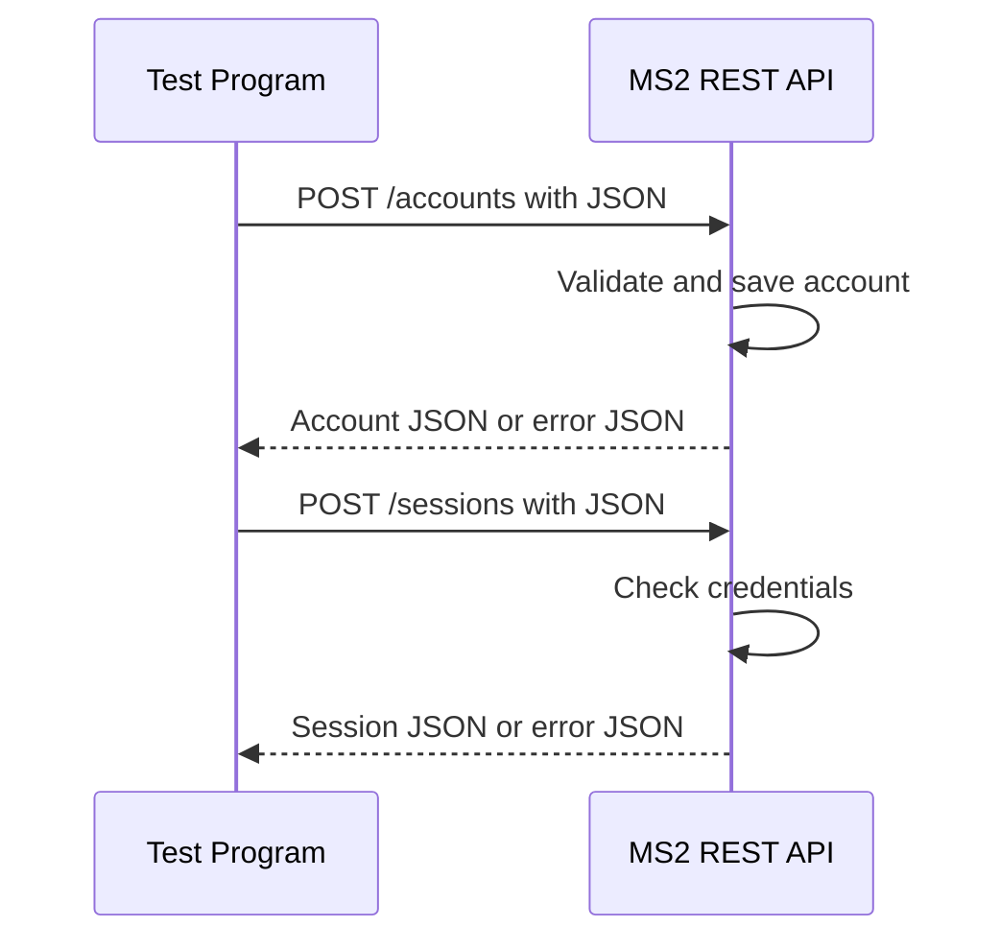

# CS361 Account Registration Service (MS2)

MS2 is a Flask microservice for account registration, login, account lookup,
and logout. A Main Program can communicate with it through a REST
API using JSON. Account data stays in the service-owned SQLite database.

The default local URL is `http://127.0.0.1:5002`.

## Setup and run

Python 3.11 or newer is recommended. From this repository in PowerShell:

```powershell
python -m venv .venv
& .\.venv\Scripts\python.exe -m pip install -r requirements-dev.txt
& .\.venv\Scripts\python.exe app.py
```

Leave the service running. In a second terminal, run the separate test program:

```powershell
& .\.venv\Scripts\python.exe test_program.py
```

The test program makes real HTTP requests and prints each request and response.
It demonstrates registration, login, account lookup, logout, and rejection of a
revoked token using generated fake account data.

Run the automated tests with:

```powershell
& .\.venv\Scripts\python.exe -m pytest -q
```

## REST API contract

Send JSON requests with `Content-Type: application/json`. Protected endpoints
also require `Authorization: Bearer <session_token>`.

| Method and path | Request | Successful response |
| --- | --- | --- |
| `GET /health` | No body | HTTP 200 JSON status |
| `POST /accounts` | JSON `username`, `email`, `password` | HTTP 201 account JSON |
| `POST /sessions` | JSON `username` or `email`, plus `password` | HTTP 200 account ID and session token |
| `GET /accounts/me` | Bearer token | HTTP 200 public account JSON |
| `POST /sessions/logout` | Bearer token | HTTP 204 with no body |

Invalid requests return structured error JSON with HTTP 400, 401, or 409.
Usernames are 3-50 characters and may contain letters, numbers, periods,
underscores, and hyphens. Passwords are 12-128 characters and need an uppercase
letter, lowercase letter, number, and symbol.

### Request example

This Python example shows exactly how another program requests data from MS2:

```python
import os
import requests

base_url = os.getenv("ACCOUNT_SERVICE_URL", "http://127.0.0.1:5002")
password = "Example-Passphrase-42!"

registration = requests.post(
    f"{base_url}/accounts",
    json={
        "username": "demo_user",
        "email": "demo@example.test",
        "password": password,
    },
    timeout=5,
)

login = requests.post(
    f"{base_url}/sessions",
    json={"username": "demo_user", "password": password},
    timeout=5,
)
session_token = login.json()["session_token"]
headers = {"Authorization": f"Bearer {session_token}"}

account = requests.get(f"{base_url}/accounts/me", headers=headers, timeout=5)
logout = requests.post(f"{base_url}/sessions/logout", headers=headers, timeout=5)
```

### Response examples

Read response bodies with `response.json()`. A successful registration returns
HTTP 201:

```json
{
  "account_id": "acct_9aa4eb55e46345dd8cf37e6903579d0c",
  "username": "demo_user",
  "email": "demo@example.test"
}
```

A successful login returns HTTP 200:

```json
{
  "authenticated": true,
  "account_id": "acct_9aa4eb55e46345dd8cf37e6903579d0c",
  "session_token": "<new opaque bearer token>"
}
```

Errors use one consistent JSON shape:

```json
{
  "error": {
    "code": "DUPLICATE_EMAIL",
    "message": "An account already uses that email address.",
    "field": "email"
  }
}
```

Generated account IDs and tokens will differ. Logout returns HTTP 204 with no
body, so do not call `response.json()` on a successful logout response.

## UML sequence diagram



## Main Program integration

MS2 provides account storage, validation, password hashing, sessions, a fixed
REST API contract, and structured errors. The generic JavaScript client is in
[`examples/account-service-client.js`](examples/account-service-client.js).
The A Habit A Day field adapter is in
[`examples/a-habit-a-day-account-client.js`](examples/a-habit-a-day-account-client.js).

For a Vite Main Program, copy the adapter into its `src` directory and set:

```dotenv
VITE_ACCOUNT_SERVICE_URL=http://127.0.0.1:5002
```

```javascript
import {
  AccountServiceClient,
  AccountServiceError,
} from "./account-service-client.js";

const accounts = new AccountServiceClient();

try {
  await accounts.register({ username, email, password });
  const session = await accounts.login({ username, password });
  const me = await accounts.currentAccount(session.session_token);
  await accounts.logout(session.session_token);
} catch (error) {
  if (error instanceof AccountServiceError) {
    console.error(error.code, error.message);
  } else {
    throw error;
  }
}
```

Non-Vite or deployed clients can pass a configured URL directly with
`new AccountServiceClient(serviceUrl)`. Browser projects running on a different
origin must also add that exact origin to `ACCOUNT_ALLOWED_ORIGINS` before MS2
starts. Each Main Program keeps its own non-account data; MS2 receives only the
documented account fields.

### A Habit A Day remaining task

A Habit A Day needs to:

1. Copy both JavaScript account clients into the app's `src` directory.
2. Replace the direct registration and login fetches with `HabitAccountClient`.
3. Add the MS2 password rules to the registration form instructions.
4. Decide how an MS2 `account_id` connects to the protected habit data.
5. Add one consumer-side test for registration, login, or a handled error.

The MS2 session token is not the same as the current Express JWT. A Habit A Day
needs an explicit account/session connection before the protected habit routes
can use MS2 authentication.

### PrepTrack remaining task

PrepTrack needs to:

1. Copy `account-service-client.js` into the PrepTrack `src` directory.
2. Connect `AccountServiceClient` to the registration and login UI.
3. Store the returned session token for the active PrepTrack session.
4. Add one consumer-side test for registration, login, or a handled error.

PrepTrack can keep username login or use
`accounts.login({ email, password })`. PrepTrack inventory stays in PrepTrack;
MS2 only receives account fields and returns the account ID and session token.

### Integration note required

A completed Main Program integration needs a short README note containing:

- Main Program name and language/framework
- account client location
- connected flow, such as registration, login, or logout
- one successful integration test and one handled error

Main Program source and tests stay in the Main Program repository. Do not copy
an app, environment file, database, password, or token into this service repo.

## Configuration and security

| Environment variable | Default |
| --- | --- |
| `ACCOUNT_DATABASE_PATH` | `instance/accounts.sqlite3` |
| `ACCOUNT_SESSION_TTL_SECONDS` | `3600` |
| `ACCOUNT_ALLOWED_ORIGINS` | `http://localhost:5173,http://127.0.0.1:5173` |
| `ACCOUNT_HOST` / `ACCOUNT_PORT` | `127.0.0.1` / `5002` |
| `ACCOUNT_SERVICE_URL` | `http://127.0.0.1:5002` |

Passwords are stored as salted scrypt hashes, and session tokens are stored as
SHA-256 hashes. Do not commit databases, environment files, passwords, tokens,
or real personal data. The service is configured for local use; add HTTPS and
request throttling before exposing it on a network.
