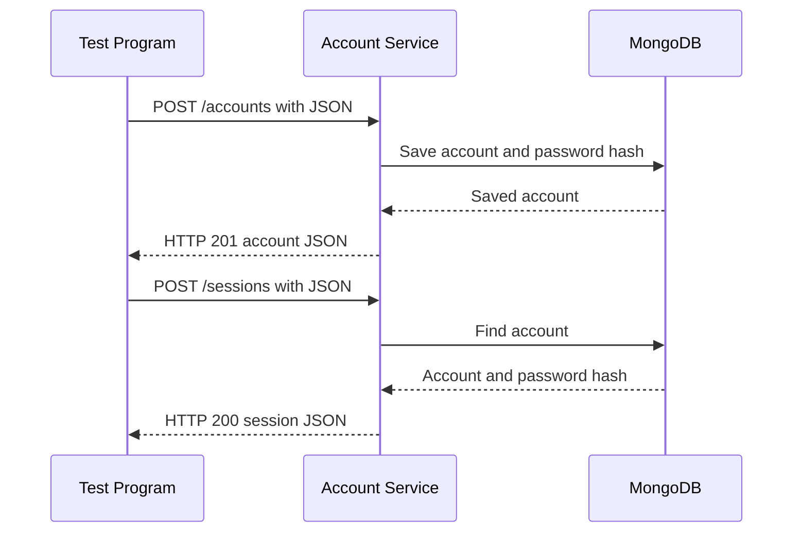

# Account Registration Service (MS2)

MS2 handles account registration, login, account lookup, and logout. It uses an
Express REST API with JSON and stores accounts in MongoDB. Passwords are hashed
with bcrypt before they are stored.

The default local URL is `http://127.0.0.1:5002`.

## Setup

Node.js and MongoDB are required.

### Windows

```powershell
npm install
Copy-Item .env.example .env
npm start
```

### macOS or Linux

```bash
npm install
cp .env.example .env
npm start
```

Set `MONGODB_URI` and replace `JWT_SECRET` in `.env` before starting the
service. `JWT_SECRET` must have at least 32 characters. The same secret can be
used by A Habit A Day's protected habit routes because the token includes the
same `userId` field.

For a quick local demonstration without installing MongoDB, run:

```powershell
npm run demo-service
```

This starts the service with a temporary MongoDB database. The data is removed
when the process stops.

## Request data

Send JSON with `Content-Type: application/json`.

| Method and path | Purpose |
| --- | --- |
| `GET /health` | Check whether the service is running |
| `POST /accounts` | Register an account |
| `POST /sessions` | Log in with a username or email |
| `GET /accounts/me` | Receive the account for a bearer token |
| `POST /sessions/logout` | Log out and invalidate active MS2 tokens |

Registration requires `username`, `email`, and `password`. `name` is optional
and defaults to the username.

```javascript
const response = await fetch("http://127.0.0.1:5002/accounts", {
  method: "POST",
  headers: { "Content-Type": "application/json" },
  body: JSON.stringify({
    username: "demo_user",
    name: "Demo User",
    email: "demo@example.test",
    password: "Example-Passphrase-42!"
  })
})
```

Usernames must be 3-50 characters and may contain letters, numbers, periods,
underscores, and hyphens. Passwords must be 12-128 characters and contain an
uppercase letter, lowercase letter, number, and symbol.

Login accepts either `username` or `email`, but not both:

```javascript
const response = await fetch("http://127.0.0.1:5002/sessions", {
  method: "POST",
  headers: { "Content-Type": "application/json" },
  body: JSON.stringify({
    email: "demo@example.test",
    password: "Example-Passphrase-42!"
  })
})
```

## Receive data

Read successful registration and login responses with `response.json()`.
Registration returns HTTP 201:

```json
{
  "account_id": "66b00fdcc06e636f38be8181",
  "name": "Demo User",
  "username": "demo_user",
  "email": "demo@example.test"
}
```

Login returns HTTP 200:

```json
{
  "authenticated": true,
  "account_id": "66b00fdcc06e636f38be8181",
  "session_token": "<JWT bearer token>"
}
```

Use that token for protected requests:

```javascript
const accountResponse = await fetch("http://127.0.0.1:5002/accounts/me", {
  headers: { Authorization: `Bearer ${session.session_token}` }
})
const account = await accountResponse.json()
```

Logout returns HTTP 204 with an empty body. Errors return JSON such as:

```json
{
  "error": {
    "code": "INVALID_CREDENTIALS",
    "message": "Invalid username, email, or password."
  }
}
```

## Communication sequence



## Test program

Keep the service running in one terminal. Run the separate test program in a
second terminal:

```powershell
npm run demo-test
```

The test program imports no service files. It sends real HTTP requests for the
health check, registration, login, account lookup, logout, and rejected token.

Run the automated contract tests with:

```powershell
npm test
```

## Main Program hookup

`examples/account-service-client.js` is the general browser client.
`examples/a-habit-a-day-account-client.js` maps A Habit A Day's existing
`name`, `email`, and `password` fields to this contract.

A Habit A Day still needs the client connected to its registration and login
forms. Its habit API must use the same MongoDB user IDs and JWT secret, or check
the token through `GET /accounts/me`.

PrepTrack still needs the general client connected to its registration and
login screens. Set `VITE_ACCOUNT_SERVICE_URL=http://127.0.0.1:5002` in the
PrepTrack environment file.

Each Main Program still needs one consumer-side test for a successful request
or a handled error. Main Program source stays in its own repository.
